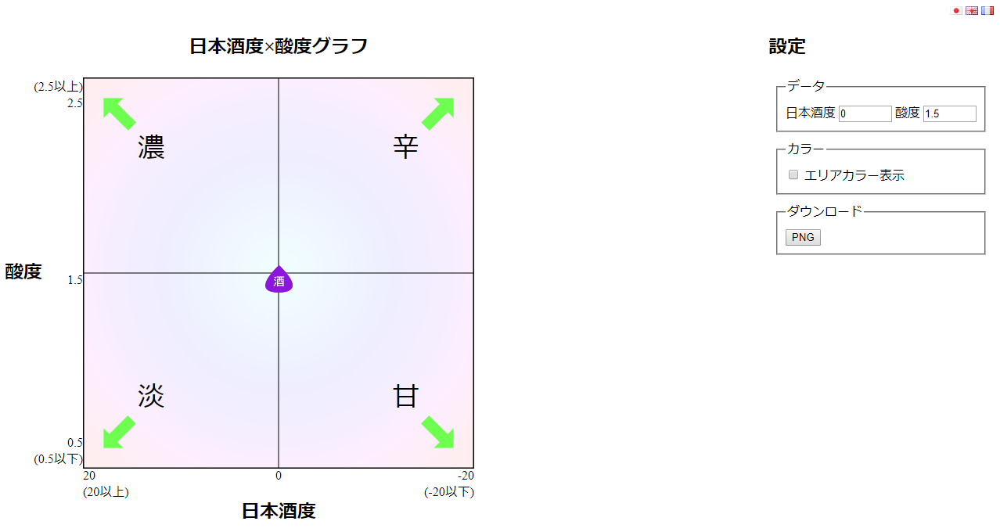
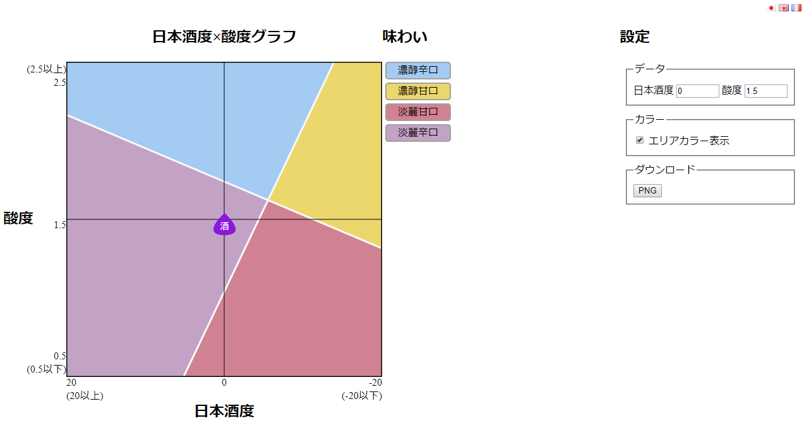

# Sakechart

## Requirements

 - PHP Gettext

## Description  

A JS chart to classify Japanese sake I did a long time ago.

You just need a web server running `PHP`.  
PHP is required to use I18n translations.

Available in:
 + Japanese
 + English
 + French

# Screenshots  

